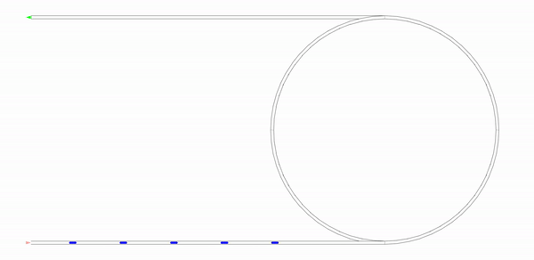

**| [Overview](#overview) | [Structure](#structure) | [Launching simulations](#launching-simulations) | [External tools](#external-tools) | [License](#license) | [Contact](#contact) |**

# Control strategy for congestion wave absorption

**A Control Strategy for CAV towards the Absorption of Traffic Oscillations**

Andres Ladino, Aurelien Duret


## Overview 

This repository contains source code used to generate the example in *"A Control Strategy for CAV towards the Absorption of Traffic Oscillations"* by  [Andres Ladino](https://www.andresladino.com), [Aurelien Duret](https://www.researchgate.net/profile/Aurelien_Duret). The objective of this research is to design a mechanism to absorb congestion waves via Connected & Autonomous Vehicles. 

**Scenario**

 

## Structure 

[Notebooks](notebook.ipynb): Contains the files to reproduce the paper results. 

## Launching simulations 

Download this repository

```{bash}
git clone https://github.com/aladinoster/wave-congestion-absorption.git
```

Be sure to get [conda](https://www.anaconda.com/distribution/), then:

```{bash}
conda env create -f environment.yml
conda activate wavabs
jupyter lab Notebbok.ipynb
```

## License

Thee code here contained is licensed under [MIT License](LICENSE)

## Contact 

If you run into problems or bugs, please let us know by [creating an issue](https://github.com/aladinoster/wave-congestion-absorption/issues/new) an issue in this repository.